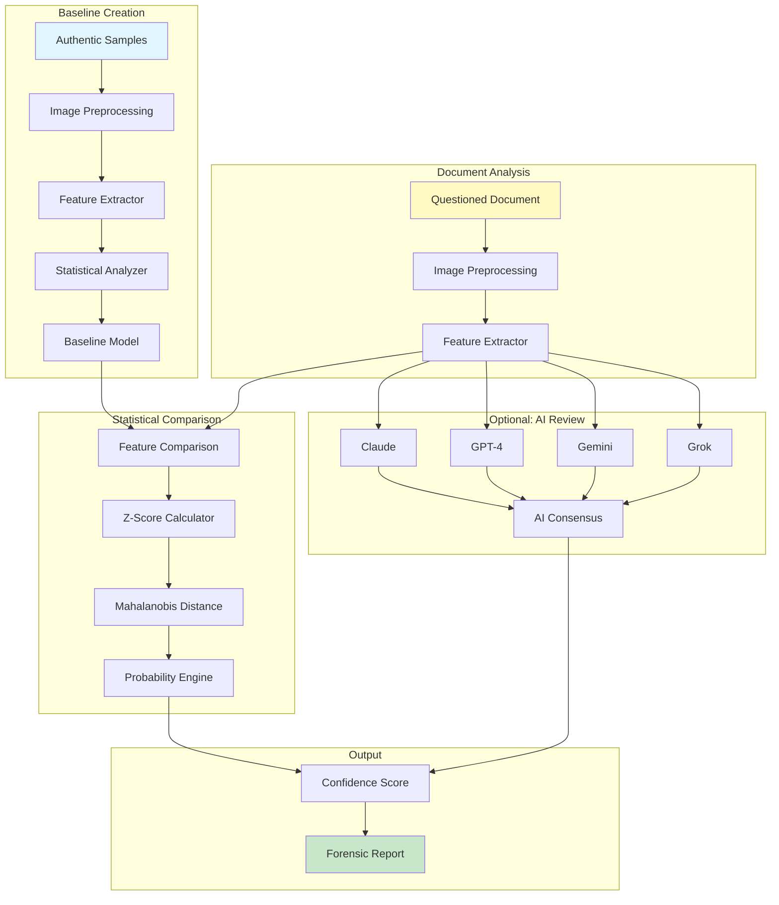

# Handwriting Analysis System


[](https://codecov.io/gh/jjshay/handwriting-analysis)


**Forensic-grade signature and handwriting analysis - statistical comparison for authentication.**

[](https://asciinema.org/a/bWZcm0S3ayeCsVy4)

[](https://asciinema.org/a/bWZcm0S3ayeCsVy4)

---

## What Does This Do?

Analyze signatures and handwriting for authenticity:

1. **Extract features** from signature images (slant, pressure, proportions)
2. **Build baseline** from known authentic samples
3. **Compare questioned documents** against the baseline
4. **Generate reports** with statistical confidence scores

**Use cases:**
- Art authentication (artist signatures)
- Document verification
- Forensic analysis
- Research and education

---

## Quick Start

```bash
# Clone the repo
git clone https://github.com/jjshay/handwriting-analysis.git
cd handwriting-analysis

# Install dependencies
pip install -r requirements.txt

# Run the interactive demo
python demo.py

# Or run the visual showcase
python showcase.py

# Analyze with sample signatures
python forensic_handwriting_analyzer.py \
  --baseline examples/sample_baseline_data.json \
  --questioned examples/signature_questioned.png
```

### Sample Files
- `examples/signature_authentic_01.png` - Sample authentic signatures
- `examples/signature_questioned.png` - Questioned signature to analyze
- `examples/sample_baseline_data.json` - Pre-computed baseline stats
- `sample_output/forensic_report.txt` - Example analysis report

---

## Architecture



## How It Works

```
Known Authentic Samples (70+)
            │
            ▼
┌─────────────────────────────────────────┐
│       FEATURE EXTRACTION                 │
│  - Slant angle (60-90°)                  │
│  - Height ratios                         │
│  - Stroke characteristics                │
│  - Pressure patterns                     │
│  - Connected vs lifted strokes           │
└─────────────────────────────────────────┘
            │
            ▼
┌─────────────────────────────────────────┐
│       STATISTICAL BASELINE              │
│  Mean ± Standard Deviation for each     │
│  feature across all authentic samples   │
└─────────────────────────────────────────┘
            │
            ▼
  Questioned Document
            │
            ▼
┌─────────────────────────────────────────┐
│       STATISTICAL COMPARISON            │
│  - Z-scores for each feature            │
│  - Mahalanobis distance                 │
│  - Probability calculations             │
└─────────────────────────────────────────┘
            │
            ▼
  Authentication Report
  (Confidence: 94.7%)
```

---

## Features Extracted

| Feature | Description | Typical Range |
|---------|-------------|---------------|
| Slant Angle | Degrees from horizontal | 60-90° |
| Height Ratio | Full height / x-height | 2.0-3.5 |
| Aspect Ratio | Width / Height of bounding box | 1.5-4.0 |
| Stroke Width | Average pen stroke thickness | 2-8 px |
| Pressure Variance | Variation in stroke darkness | 0.1-0.4 |
| Connectedness | % of connected strokes | 40-80% |
| Loop Ratio | Loops per letter | 0.2-0.6 |

---

## Output Report

```
FORENSIC HANDWRITING ANALYSIS REPORT
=====================================
Document ID: QD-2024-001
Analysis Date: January 8, 2024

FEATURE COMPARISON:
  Slant Angle:      73.2° (Baseline: 71.5° ± 4.2°)  → WITHIN RANGE
  Height Ratio:     2.8   (Baseline: 2.6 ± 0.3)    → WITHIN RANGE
  Stroke Width:     4.1px (Baseline: 3.8 ± 0.8)    → WITHIN RANGE
  Pressure Var:     0.28  (Baseline: 0.25 ± 0.08)  → WITHIN RANGE

STATISTICAL ANALYSIS:
  Combined Z-Score: 0.82
  Mahalanobis Distance: 1.24

CONCLUSION:
  Confidence: 94.7%
  Opinion: The questioned signature is CONSISTENT with
           the known authentic baseline samples.
```

---

## Multi-AI Review (Optional)

For additional verification, the system can use multiple AI models:

| AI Model | Role |
|----------|------|
| Claude | Detailed stroke analysis |
| GPT-4 | Pattern recognition |
| Gemini | Visual comparison |
| Grok | Anomaly detection |

Each AI provides independent analysis, then results are combined for consensus.

---

## Setup

### Basic (Statistical Only)
```bash
pip install -r requirements.txt
python demo.py
```

### Full AI Mode
```bash
cp .env.example .env
nano .env
# Add API keys
python llm_handwriting_reviewer.py
```

---

## Files

| File | Purpose |
|------|---------|
| `forensic_handwriting_analyzer.py` | Main statistical analyzer |
| `signature_analyzer.py` | Signature-specific analysis |
| `statistical_signature_generator.py` | Generate test signatures |
| `llm_handwriting_reviewer.py` | Multi-AI review system |
| `demo.py` | Demo without dependencies |

---

## Important Notes

- This is a research/educational tool
- Not a replacement for professional forensic examination
- Statistical analysis provides probability, not certainty
- Always consult qualified experts for legal matters

---

## License

MIT - For research and educational use
